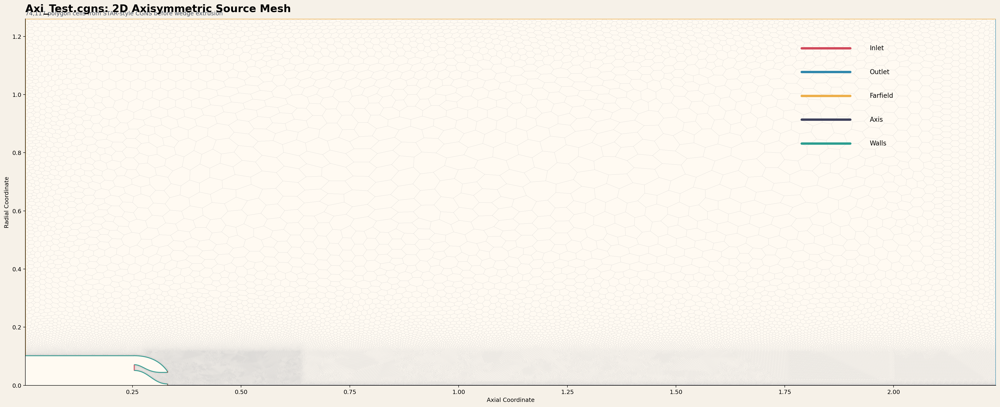

# Axisymmetric CGNS Workflow

This document covers the dedicated axisymmetric import path in this repository.

It is intentionally separate from the 3D mixed-cell importer documented in the
top-level [README.md](./README.md). That separation is a design decision, not a
temporary workaround.

## Executive Summary

`Axi_Test.cgns` is a real STAR-style 2D axisymmetric CGNS mesh.

It is not:

- a pre-built OpenFOAM wedge mesh
- a thin 3D sector mesh
- a simple 2D triangulation that can be passed through a generic converter

Instead, it is a 2D polygon mesh with edge-based boundary definitions. OpenFOAM
cannot run directly on that representation, so the workflow implemented here
converts it into a valid 3D wedge mesh.

Final result:

- the generated `axi_test_case` passes `checkMesh`
- the importer remains isolated from the 3D tet/prism path

## Source Mesh Characteristics

Inspection of `Axi_Test.cgns` showed:

- coordinates stored in the `X-Y` plane
- `CoordinateZ` identically zero
- 2D polygon cell region
- boundary entities defined on `EdgeCenter`
- explicit boundary groups including:
  - `TJ_Nozzle_R1.AXIS`
  - `TJ_Nozzle_R1.INLET`
  - `TJ_Nozzle_R1.OUTLET`
  - `TJ_Nozzle_R1.FS`
  - internal and external wall groups

CGNS mesh summary observed during import:

- `139808` source points
- `74117` 2D polygon cells

These are not 3D cells. They must be extruded.

## Why the Existing 3D Importer Was Not Reused

The existing `import_cgns_to_foam.py` assumes:

- 3D cells already exist
- faces can be reconstructed from 3D cell templates
- boundary groups refer to surface faces

None of those assumptions hold here.

For the axisymmetric file:

- cells are 2D polygons
- boundaries are edges
- OpenFOAM requires a wedge-style 3D representation

Mixing these two workflows into one script would have made the code harder to
reason about and more brittle. The dedicated axisymmetric importer avoids that.

## Implemented Axisymmetric Strategy

The separate importer is:

- [import_axi_cgns_to_wedge_foam.py](./import_axi_cgns_to_wedge_foam.py)

The implemented approach is:

1. Read the 2D source points and polygon cells from CGNS.
2. Read the edge-based boundary groups from CGNS.
3. Identify the axis line from the dedicated axis patch.
4. Duplicate non-axis points onto two wedge planes.
5. Collapse axis points onto the centerline so they remain single points.
6. Sweep each 2D polygon into a 3D wedge-sector style polyhedral cell.
7. Write OpenFOAM `polyMesh` files.
8. Add the two wedge patches required by OpenFOAM.
9. Keep the axis patch as a zero-face `empty` patch, matching local OpenFOAM
   wedge examples.

## Critical Implementation Detail: Axis Handling

The most important axis-specific lesson in this workflow was:

- the axis should not be written as a boundary surface of collapsed faces

That first version produced:

- duplicate-vertex faces
- zero-area faces
- non-manifold axis behavior

Comparison with local OpenFOAM wedge examples showed the correct pattern:

- the `axis` patch exists
- its type is `empty`
- it contains `0` faces

Once the importer adopted that convention, the wedge topology aligned much more
cleanly with OpenFOAM expectations.

## Critical Implementation Detail: Side-Face Orientation

A second major issue was internal side-face orientation.

A generic center-based face orientation rule was not sufficient for the
extruded polygon faces. The fix was to orient side faces using:

- the original 2D polygon edge direction
- the inferred polygon winding
- the edge-normal direction in the axisymmetric source plane

That reduced the remaining topology and geometry errors enough for the final
mesh to pass validation.

## Generated OpenFOAM Case

The importer writes:

- `axi_test_case/constant/polyMesh/points`
- `axi_test_case/constant/polyMesh/faces`
- `axi_test_case/constant/polyMesh/owner`
- `axi_test_case/constant/polyMesh/neighbour`
- `axi_test_case/constant/polyMesh/boundary`

It also writes minimal `system/` files so the case can be checked directly with
`checkMesh`.

Generated wedge-case summary:

- `278096` 3D points
- `74117` cells
- `360639` faces
- one connected region

Boundary patches in the final OpenFOAM case:

- `fs`
- `outlet`
- `axis`
- `inlet`
- `int_walls`
- `ext_walls`
- `nozzle_te`
- `tc_walls`
- `wedge_front`
- `wedge_back`

The `axis` patch is intentionally:

- type `empty`
- zero faces

## Validation Result

The final generated axisymmetric wedge case passes `checkMesh`.

Important geometric summary from the successful validation:

- mesh has `2` geometric directions and `3` solution directions
- wedge angle is `0.5 degrees` per side for the default `1 degree` total wedge
- boundary openness: `OK`
- max cell openness: `OK`
- face area magnitudes: `OK`
- cell volumes: `OK`
- non-orthogonality: `OK`
- face pyramids: `OK`
- skewness: `OK`
- overall result: `Mesh OK`

## Mesh Visualization

The source mesh image used in this repo is:

- [docs/axi_test_mesh_full.png](./docs/axi_test_mesh_full.png)

Preview:



This image is intentionally a source-mesh view, not the final 3D wedge case.
Its job is to document the axisymmetric input geometry that drove the importer
design.

## How to Run the Axisymmetric Workflow

Use the wrapper:

```bash
cd /home/ads-user/openfoam/cgns-import-workflow
./import_axi_test.sh
```

Or run the importer directly:

```bash
cd /home/ads-user/openfoam/cgns-import-workflow
.venv/bin/python import_axi_cgns_to_wedge_foam.py Axi_Test.cgns axi_test_case
```

Validate the generated case:

```bash
source /usr/share/openfoam/etc/bashrc
checkMesh -case /home/ads-user/openfoam/cgns-import-workflow/axi_test_case
```

## Files Relevant to This Workflow

- `Axi_Test.cgns`
  Source axisymmetric CGNS file used for development and validation.

- `import_axi_cgns_to_wedge_foam.py`
  The dedicated axisymmetric importer.

- `import_axi_test.sh`
  Convenience wrapper for the sample case.

- `axi_test_case/`
  Generated OpenFOAM wedge case.

- `docs/axi_test_mesh.png`
  Earlier multi-panel mesh preview.

- `docs/axi_test_mesh_full.png`
  Final preferred full-domain documentation image.

## What This Workflow Does Not Cover

This axisymmetric importer is not meant to solve every CGNS case.

It is specifically designed for:

- STAR-style 2D axisymmetric polygon meshes
- edge-based CGNS boundary definitions
- wedge extrusion into OpenFOAM

It does not attempt to support:

- arbitrary 3D polyhedral NGON/NFACE meshes
- generic CGNS layouts from every upstream tool
- automatic solver setup

It solves the import problem only.

## Recommended Next Step for New Axisymmetric Cases

When a new axisymmetric CGNS file arrives:

1. Confirm that all source points lie in a single plane.
2. Confirm that boundaries are edge-based rather than 3D face-based.
3. Confirm that an explicit axis patch exists.
4. Run the dedicated axisymmetric importer.
5. Validate with `checkMesh`.

If any of those assumptions break, treat the new file as a new problem class
instead of forcing it through this importer unchanged.

## Final Status

This workflow is complete enough to be useful:

- the importer is implemented
- the generated wedge mesh validates
- the documentation now records the actual design choices behind it

The important repository-level point is that the axisymmetric path now stands on
its own, with a working import route and a documented validation result.
